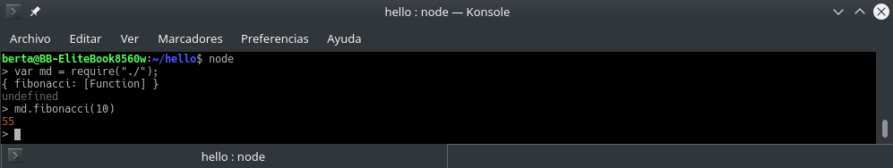

# Ultima parte del Taller
**rust + node = :heart:**

En esta sección vamos a ver como implementar node con rust, para esto en el lib.rs vamos a tener dos funciones, una que recibe parámetros string y otros int.

## Instalación

Para poder usar este código tenemos que instalar los paquetes de npm, así que ejecutamos

`$ npm install `

Cuando se hacen cambios en rust se debe compilar el codigo rust en la carpeta donde este el Cargo.toml es decir en la carpeta native

```bash
berta@BB-EliteBook8560w:~/Escritorio/rustTaller/TallerGT/taller/rust-node/native$ cargo build
    Updating registry `https://github.com/rust-lang/crates.io-index`
    .
    ..
    ...  
    Finished dev [unoptimized + debuginfo] target(s) in 27.24 secs
```

Y cuando se quiera compilar todo incluyendo node se debe hacer por fuera del native.

`$ neon build`
```bash
berta@BB-EliteBook8560w:~/Escritorio/rustTaller/TallerGT/taller/rust-node$ neon build
neon info running cargo
    .
    ..
    ...
    Finished release [optimized] target(s) in 51.42 secs
neon info generating native/index.node
```


pero eso solo compila el código. Para poder usar las funciones lo hacemos desde node

`$ node`
<p align="center">

</p>


creamos una variables que nos va a ejecutar las funciones del código y llamamos a las funciones

**Nota:** Es importante verificar muy bien cual función voy a ejecutar para no llevarse sorpresas
## Verificación de función asignada
```bash
module.exports = {
    fibonacci: function(int){
        return addon.fibonacci(int);
    }
}
console.log(addon);```
o podemos usar por fuera de node

`$ node -e 'require("./")'`

**Nota:** esto solo va a imprimir lo que hay en index.js y de acuerdo a lo que imprimí en consola no lo que la función vaya a retornar.
