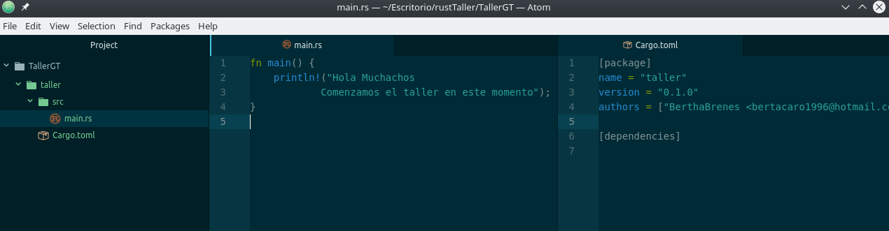

# Primera parte del taller

Este repositorio consiste en una llamada http y cargar dos paginas html.
## Iniciar proyecto
Si se quisiera iniciar un cargo desde un inicio se ejecuta

`$ cargo new taller --bin`

<p align="center">

</p>


## Compilar el código

`$ cargo build`
```bash
berta@BB-EliteBook8560w:~/Escritorio/rustTaller/TallerGT/taller/rust$ cargo build
   Compiling taller v0.1.0 (file:///home/berta/Escritorio/rustTaller/TallerGT/taller/rust)
    Finished dev [unoptimized + debuginfo] target(s) in 1.10
```


## Carga de paginas

para poder cargar las paginas html

```bash
let (status_line, filename) = if buffer.starts_with(get) {
//       ("HTTP/1.1 200 OK\r\n\r\n", "hello.html")
//   } else {
//       ("HTTP/1.1 404 NOT FOUND\r\n\r\n", "404.html")
//   };
//
//   let mut file =`` File::open(filename).unwrap();
//   let mut contents = String::new();
//   file.read_to_string(&mut contents).unwrap();
//   let response = format!("{}{}", status_line, contents);
//   stream.write(response.as_bytes()).unwrap();
//   stream.flush().unwrap();```

# Html

contenido del las paginas html

```#bash
<!DOCTYPE html>
<html lang="en">
  <head>
    <meta charset="utf-8">
    <title>Taller Rust</title>
  </head>
  <body>
    <h1>Hola</h1>
    <p>Bienvenidos al taller de Rust</p>
  </body>
</html>
```

## Correr el código


`$ cargo run`

```bash
berta@BB-EliteBook8560w:~/Escritorio/rustTaller/TallerGT/taller/rust$ cargo run
    Finished dev [unoptimized + debuginfo] target(s) in 0.0 secs
     Running `target/debug/taller`

```
